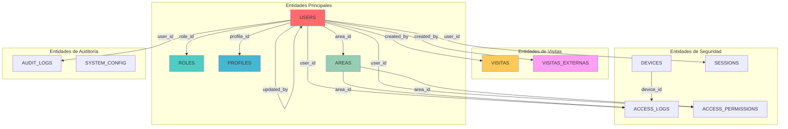
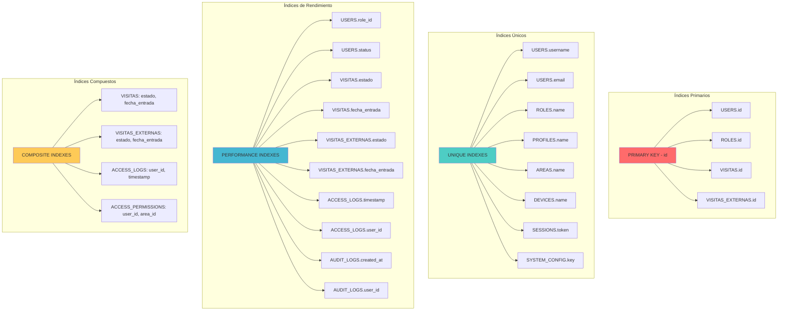
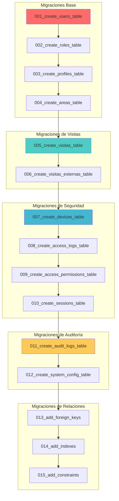
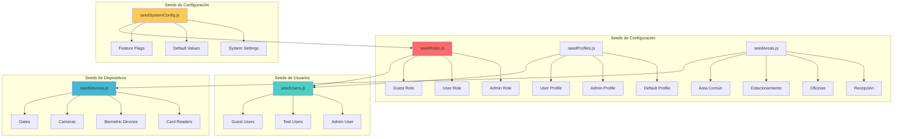
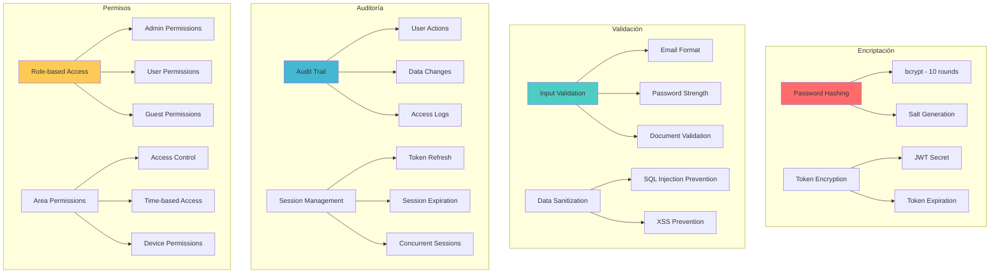
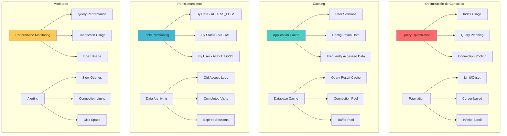
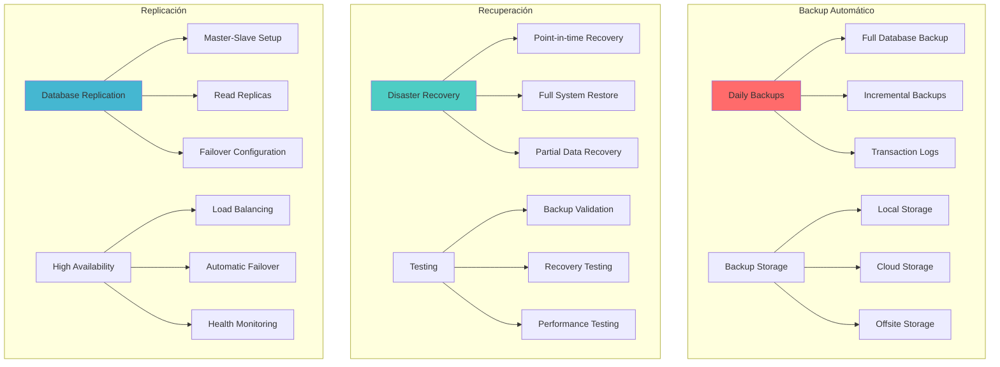

# 🗄️ Arquitectura de Base de Datos - Sistema de Control de Acceso

## 🏗️ Diseño de Base de Datos

### Diagrama de Esquema Completo

```mermaid
erDiagram
    USERS {
        int id PK "AUTO_INCREMENT"
        string username "UNIQUE, NOT NULL"
        string email "UNIQUE, NOT NULL"
        string password_hash "NOT NULL"
        string first_name "NOT NULL"
        string last_name "NOT NULL"
        string status "ENUM: active, inactive, suspended"
        int role_id FK "NOT NULL"
        int profile_id FK
        int area_id FK
        int created_by FK "SELF REFERENCE"
        int updated_by FK "SELF REFERENCE"
        timestamp created_at "DEFAULT NOW()"
        timestamp updated_at "DEFAULT NOW()"
    }
    
    ROLES {
        int id PK "AUTO_INCREMENT"
        string name "UNIQUE, NOT NULL"
        string description
        json permissions "NOT NULL"
        timestamp created_at "DEFAULT NOW()"
        timestamp updated_at "DEFAULT NOW()"
    }
    
    PROFILES {
        int id PK "AUTO_INCREMENT"
        string name "UNIQUE, NOT NULL"
        string description
        json settings "DEFAULT {}"
        timestamp created_at "DEFAULT NOW()"
        timestamp updated_at "DEFAULT NOW()"
    }
    
    AREAS {
        int id PK "AUTO_INCREMENT"
        string name "UNIQUE, NOT NULL"
        string description
        string location "NOT NULL"
        int capacity "DEFAULT 0"
        timestamp created_at "DEFAULT NOW()"
        timestamp updated_at "DEFAULT NOW()"
    }
    
    VISITAS {
        int id PK "AUTO_INCREMENT"
        string nombre "NOT NULL"
        string apellido_paterno "NOT NULL"
        string apellido_materno
        string documento "NOT NULL"
        string motivo "NOT NULL"
        string ubicacion "NOT NULL"
        string vehiculo
        string placa
        string estado "ENUM: activa, finalizada, cancelada"
        timestamp fecha_entrada "DEFAULT NOW()"
        timestamp fecha_salida
        int created_by FK "NOT NULL"
        int updated_by FK
        timestamp created_at "DEFAULT NOW()"
        timestamp updated_at "DEFAULT NOW()"
    }
    
    VISITAS_EXTERNAS {
        int id PK "AUTO_INCREMENT"
        string nombre "NOT NULL"
        string apellido_paterno "NOT NULL"
        string apellido_materno
        string documento "NOT NULL"
        string empresa "NOT NULL"
        string motivo "NOT NULL"
        string ubicacion "NOT NULL"
        string vehiculo
        string placa
        string estado "ENUM: activa, finalizada, cancelada"
        timestamp fecha_entrada "DEFAULT NOW()"
        timestamp fecha_salida
        int created_by FK "NOT NULL"
        int updated_by FK
        timestamp created_at "DEFAULT NOW()"
        timestamp updated_at "DEFAULT NOW()"
    }
    
    DEVICES {
        int id PK "AUTO_INCREMENT"
        string name "UNIQUE, NOT NULL"
        string type "ENUM: card_reader, biometric, camera, gate"
        string location "NOT NULL"
        string status "ENUM: active, inactive, maintenance"
        json configuration "DEFAULT {}"
        timestamp created_at "DEFAULT NOW()"
        timestamp updated_at "DEFAULT NOW()"
    }
    
    ACCESS_LOGS {
        int id PK "AUTO_INCREMENT"
        int user_id FK "NOT NULL"
        int device_id FK "NOT NULL"
        int area_id FK "NOT NULL"
        string action "ENUM: entry, exit, denied, timeout"
        timestamp timestamp "DEFAULT NOW()"
        json metadata "DEFAULT {}"
    }
    
    ACCESS_PERMISSIONS {
        int id PK "AUTO_INCREMENT"
        int user_id FK "NOT NULL"
        int area_id FK "NOT NULL"
        string permission_type "ENUM: read, write, admin"
        timestamp valid_from "DEFAULT NOW()"
        timestamp valid_until
        timestamp created_at "DEFAULT NOW()"
        timestamp updated_at "DEFAULT NOW()"
    }
    
    SESSIONS {
        int id PK "AUTO_INCREMENT"
        int user_id FK "NOT NULL"
        string token "UNIQUE, NOT NULL"
        timestamp expires_at "NOT NULL"
        timestamp created_at "DEFAULT NOW()"
    }
    
    AUDIT_LOGS {
        int id PK "AUTO_INCREMENT"
        int user_id FK "NOT NULL"
        string action "NOT NULL"
        string table_name "NOT NULL"
        int record_id "NOT NULL"
        json old_values
        json new_values
        timestamp created_at "DEFAULT NOW()"
    }
    
    SYSTEM_CONFIG {
        int id PK "AUTO_INCREMENT"
        string key "UNIQUE, NOT NULL"
        string value "NOT NULL"
        string description
        timestamp created_at "DEFAULT NOW()"
        timestamp updated_at "DEFAULT NOW()"
    }
    
    USERS ||--o{ ROLES : "belongs to"
    USERS ||--o{ PROFILES : "has"
    USERS ||--o{ AREAS : "assigned to"
    USERS ||--o{ VISITAS : "creates"
    USERS ||--o{ VISITAS_EXTERNAS : "creates"
    USERS ||--o{ ACCESS_LOGS : "generates"
    USERS ||--o{ ACCESS_PERMISSIONS : "has"
    USERS ||--o{ SESSIONS : "has"
    USERS ||--o{ AUDIT_LOGS : "creates"
    USERS ||--o{ USERS : "created_by/updated_by"
    DEVICES ||--o{ ACCESS_LOGS : "records"
    AREAS ||--o{ ACCESS_LOGS : "location"
    AREAS ||--o{ ACCESS_PERMISSIONS : "grants access to"
```

## 🔗 Relaciones y Constraints

### Diagrama de Relaciones Principales

## 📊 Índices y Optimización

### Estructura de Índices

## 🔄 Migraciones y Versionado

### Estructura de Migraciones

## 🌱 Seeds y Datos Iniciales

### Estructura de Seeds

## 🔐 Seguridad de Datos

### Arquitectura de Seguridad

## 📈 Rendimiento y Escalabilidad

### Estrategias de Optimización

## 🔄 Backup y Recuperación

### Estrategia de Backup

---

## 📋 Resumen de Configuración de Base de Datos

### 🗄️ Configuración PostgreSQL
- **Versión:** PostgreSQL 14+
- **Encoding:** UTF-8
- **Collation:** en_US.UTF-8
- **Connection Pool:** 20 connections
- **Timeout:** 30 seconds

### 🔧 Configuración Sequelize
- **Dialect:** postgres
- **Logging:** Development only
- **Pool:** Min 5, Max 20
- **Idle:** 10000ms
- **Acquire:** 60000ms

### 📊 Estadísticas de Tablas
- **Total Tables:** 12
- **Total Indexes:** 25+
- **Total Constraints:** 15+
- **Estimated Size:** 1-5 GB (production)

### 🔐 Configuración de Seguridad
- **Password Policy:** bcrypt with salt rounds 10
- **Session Timeout:** 24 hours
- **Token Expiration:** 24 hours
- **Max Login Attempts:** 5 per hour

---

*Arquitectura de Base de Datos - Sistema de Control de Acceso v1.0*
