# 📋 Documentación de Arquitectura - Sistema de Control de Acceso

## 🏗️ Arquitectura General del Sistema

### Diagrama de Arquitectura de Alto Nivel

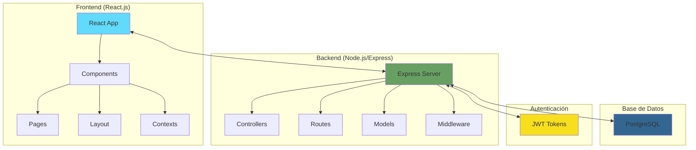

## 🗂️ Estructura de Directorios

### Estructura Completa del Proyecto

```mermaid
graph TD
    A[ControlAcceso/] --> B[frontend/]
    A --> C[backend/]
    A --> D[database/]
    A --> E[docs/]
    
    B --> B1[src/]
    B1 --> B2[components/]
    B1 --> B3[contexts/]
    B1 --> B4[config/]
    B1 --> B5[utils/]
    
    B2 --> B2A[Layout.js]
    B2 --> B2B[Login.js]
    B2 --> B2C[Dashboard.js]
    B2 --> B2D[ProtectedRoute.js]
    B2 --> B2E[usuarios/]
    B2 --> B2F[visitas/]
    B2 --> B2G[Visita_Externa/]
    B2 --> B2H[propietarios/]
    
    C --> C1[src/]
    C1 --> C2[controllers/]
    C1 --> C3[models/]
    C1 --> C4[routes/]
    C1 --> C5[middleware/]
    C1 --> C6[seeds/]
    C1 --> C7[config/]
    
    C2 --> C2A[authController.js]
    C2 --> C2B[userController.js]
    C2 --> C2C[visitaController.js]
    C2 --> C2D[visitaExternaController.js]
    C2 --> C2E[accessController.js]
    
    C3 --> C3A[User.js]
    C3 --> C3B[Role.js]
    C3 --> C3C[Profile.js]
    C3 --> C3D[Visita.js]
    C3 --> C3E[VisitaExterna.js]
    C3 --> C3F[Area.js]
    C3 --> C3G[Device.js]
    C3 --> C3H[AccessLog.js]
    C3 --> C3I[AccessPermission.js]
    C3 --> C3J[Session.js]
    C3 --> C3K[Audit.js]
    C3 --> C3L[SystemConfig.js]
    
    style A fill:#ff6b6b
    style B fill:#4ecdc4
    style C fill:#45b7d1
    style D fill:#96ceb4
    style E fill:#feca57
```

## 🗄️ Modelo de Datos

### Diagrama Entidad-Relación

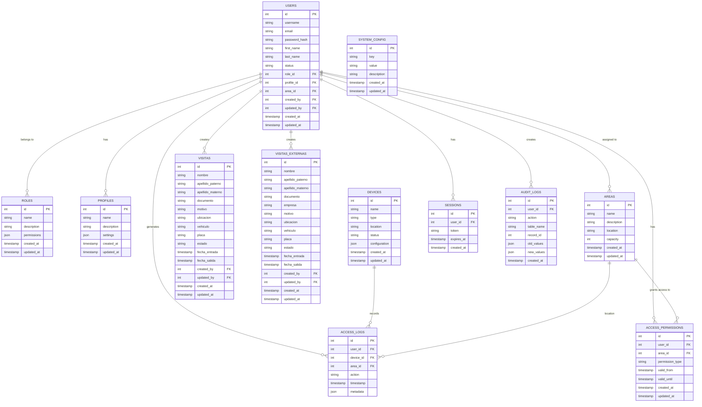

## 🔄 Flujo de Datos

### Flujo de Autenticación

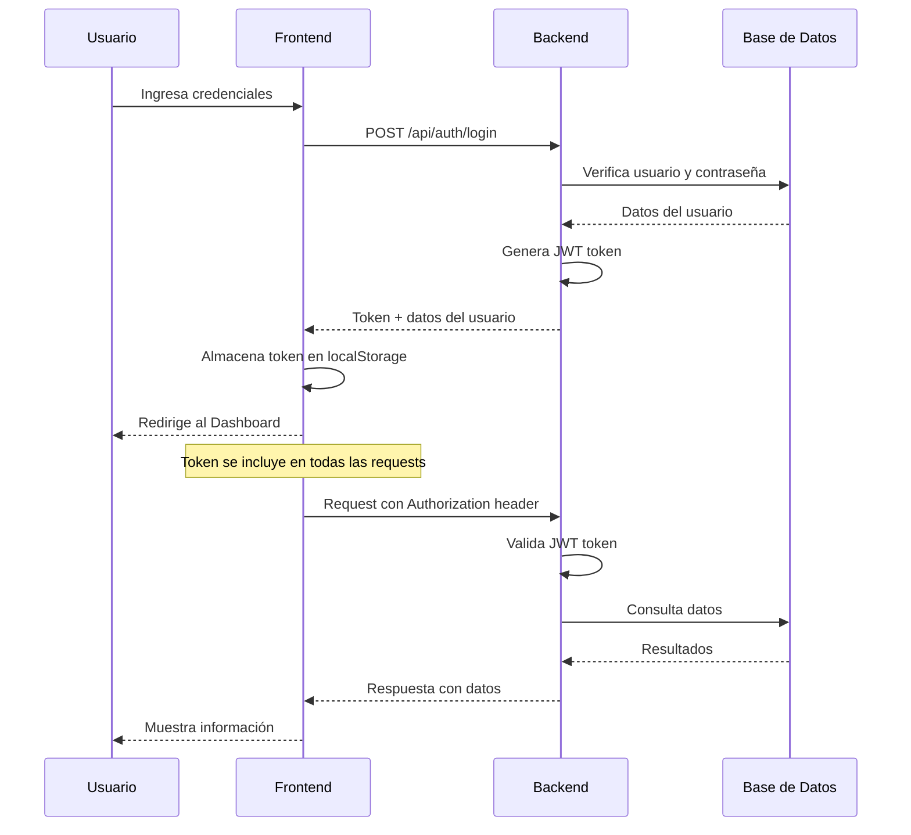

### Flujo de Gestión de Visitas

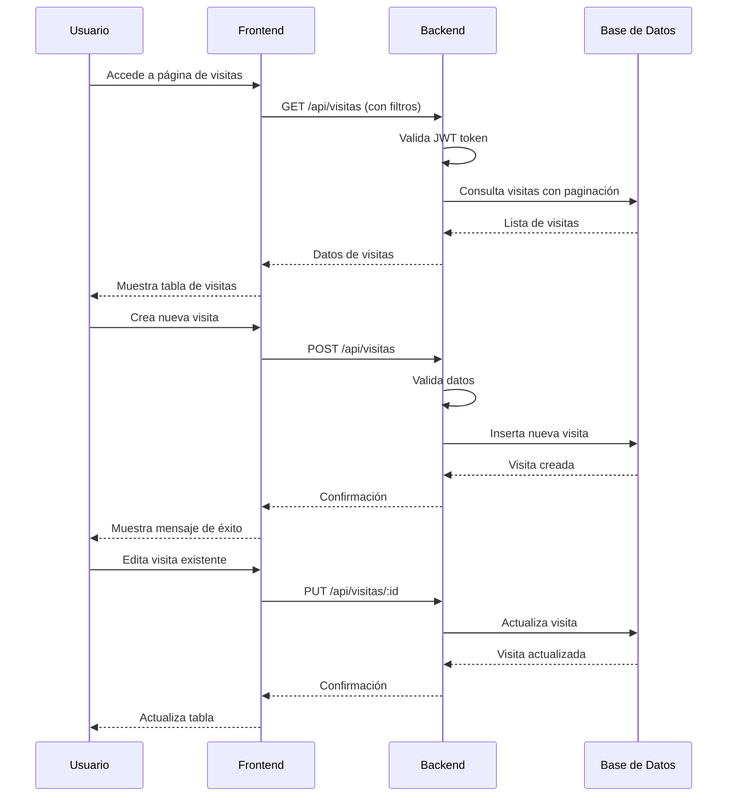

## 🎨 Arquitectura Frontend

### Estructura de Componentes

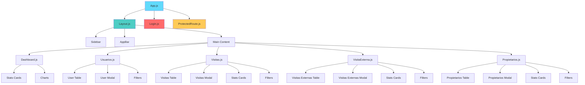

### Flujo de Context y Estado

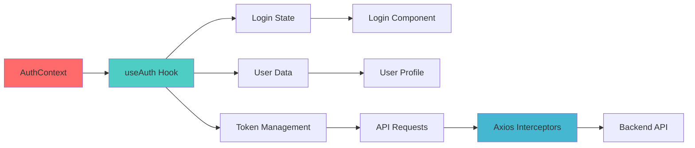

## 🔧 Arquitectura Backend

### Estructura de Capas

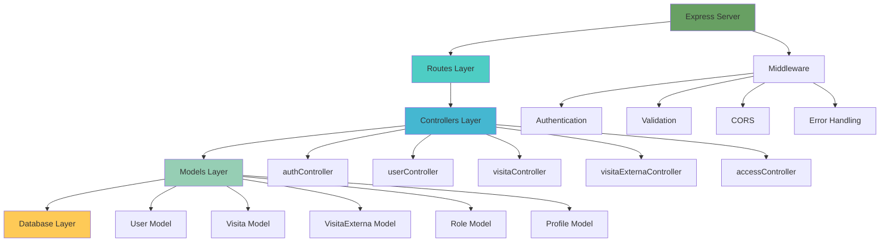

### Patrón MVC Implementado

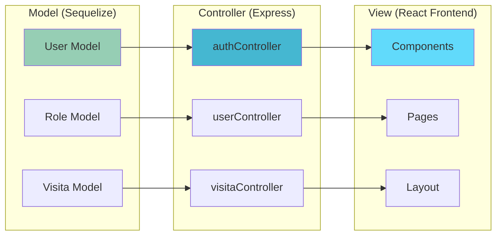

## 🔐 Seguridad y Autenticación

### Arquitectura de Seguridad

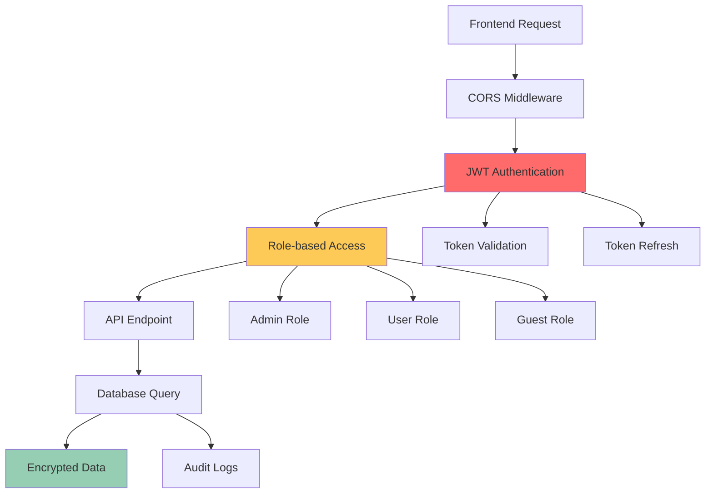

## 📊 APIs y Endpoints

### Estructura de APIs

```mermaid
graph TD
    A[/api] --> B[/auth]
    A --> C[/users]
    A --> D[/visitas]
    A --> E[/visitas-externas]
    A --> F[/access]
    
    B --> B1[POST /login]
    B --> B2[POST /logout]
    B --> B3[GET /me]
    B --> B4[POST /refresh]
    
    C --> C1[GET / - List users]
    C --> C2[POST / - Create user]
    C --> C3[GET /:id - Get user]
    C --> C4[PUT /:id - Update user]
    C --> C5[DELETE /:id - Delete user]
    
    D --> D1[GET / - List visitas]
    D --> D2[POST / - Create visita]
    D --> D3[GET /:id - Get visita]
    D --> D4[PUT /:id - Update visita]
    D --> D5[DELETE /:id - Delete visita]
    
    E --> E1[GET / - List visitas externas]
    E --> E2[POST / - Create visita externa]
    E --> E3[GET /:id - Get visita externa]
    E --> E4[PUT /:id - Update visita externa]
    E --> E5[DELETE /:id - Delete visita externa]
    
    F --> F1[GET /logs - Access logs]
    F --> F2[POST /permissions - Grant access]
    F --> F3[DELETE /permissions - Revoke access]
    
    style A fill:#68a063
    style B fill:#ff6b6b
    style C fill:#4ecdc4
    style D fill:#45b7d1
    style E fill:#96ceb4
```

## 🚀 Despliegue y Configuración

### Arquitectura de Despliegue

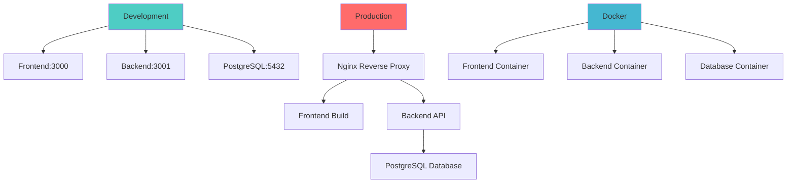

## 📈 Monitoreo y Logs

### Sistema de Logging

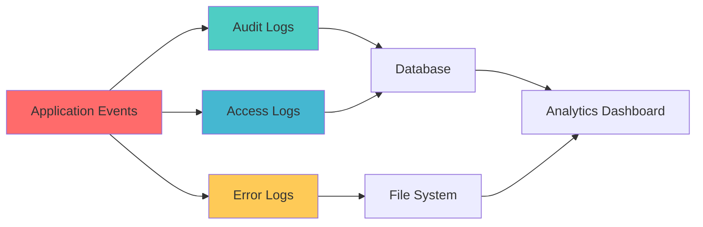

## 🔄 Flujo de Desarrollo

### Git Workflow

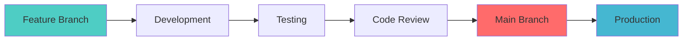

---

## 📋 Resumen de Tecnologías

### Frontend
- **Framework:** React.js 18
- **UI Library:** Material-UI (MUI) v5
- **State Management:** React Context API
- **HTTP Client:** Axios
- **Routing:** React Router DOM v6
- **Build Tool:** Create React App

### Backend
- **Runtime:** Node.js
- **Framework:** Express.js
- **ORM:** Sequelize v6
- **Database:** PostgreSQL
- **Authentication:** JWT (jsonwebtoken)
- **Password Hashing:** bcryptjs
- **Validation:** Express-validator

### Base de Datos
- **Database:** PostgreSQL 14+
- **Connection Pool:** Sequelize
- **Migrations:** Sequelize CLI
- **Seeding:** Custom seeders

### DevOps
- **Containerization:** Docker
- **Orchestration:** Docker Compose
- **Version Control:** Git
- **Environment:** Development/Production

---

*Documentación generada automáticamente - Sistema de Control de Acceso v1.0*
