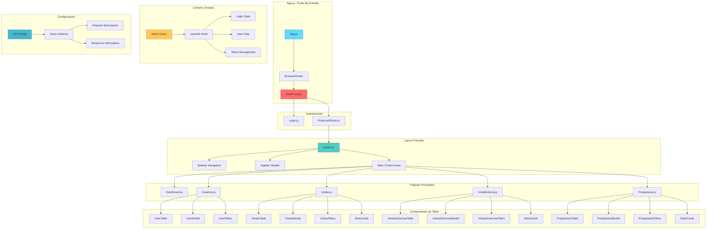
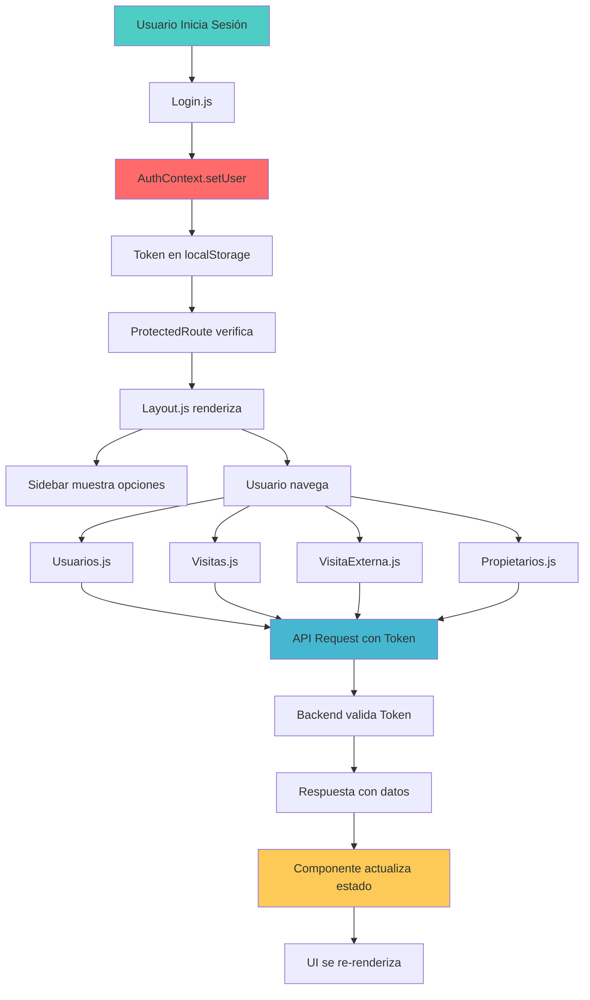
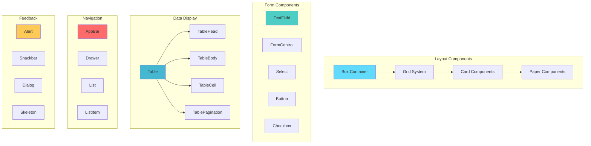
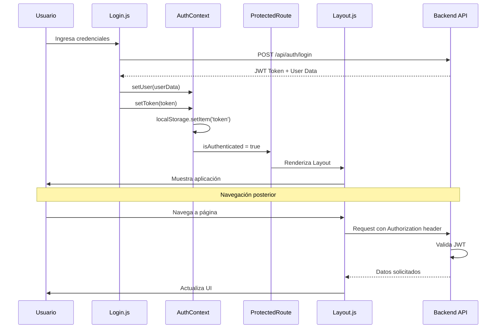
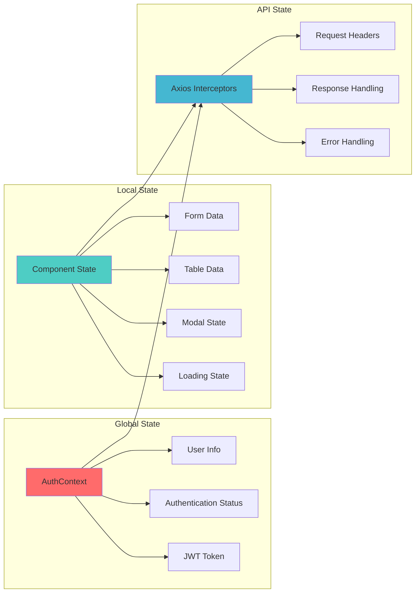
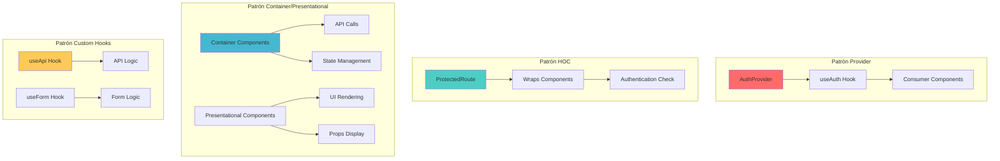
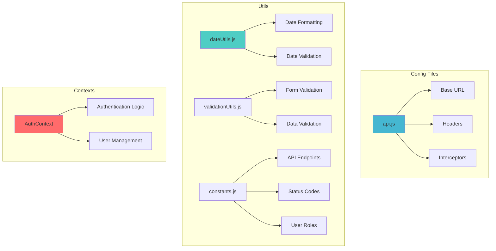

# 🧩 Diagrama de Componentes - Sistema de Control de Acceso

## 🎯 Componentes Principales y sus Interacciones

### Diagrama de Componentes Frontend

## 🔄 Flujo de Datos entre Componentes

### Diagrama de Flujo de Estado

## 🎨 Estructura de UI Components

### Jerarquía de Componentes Material-UI

## 🔐 Autenticación y Autorización

### Flujo de Autenticación Detallado

## 📊 Gestión de Estado

### Arquitectura de Estado

## 🎯 Patrones de Diseño Implementados

### Patrones Utilizados

## 🔧 Configuración y Utilidades

### Estructura de Configuración

---

## 📋 Resumen de Componentes por Funcionalidad

### 🔐 Autenticación
- **Login.js**: Formulario de inicio de sesión
- **ProtectedRoute.js**: Protección de rutas
- **AuthContext.js**: Gestión global de autenticación

### 🏠 Layout
- **Layout.js**: Estructura principal de la aplicación
- **Sidebar**: Navegación lateral
- **AppBar**: Barra superior

### 👥 Gestión de Usuarios
- **Usuarios.js**: Página principal de usuarios
- **UserTable**: Tabla de usuarios
- **UserModal**: Modal para crear/editar usuarios

### 📝 Gestión de Visitas
- **Visitas.js**: Página de visitas internas
- **VisitaExterna.js**: Página de visitas externas
- **VisitasTable**: Tabla de visitas
- **VisitasModal**: Modal para crear/editar visitas

### 🏘️ Gestión de Propietarios
- **Propietarios.js**: Página de propietarios/residentes
- **PropietariosTable**: Tabla de propietarios
- **PropietariosModal**: Modal para crear/editar propietarios

### 📊 Dashboard
- **Dashboard.js**: Página principal con estadísticas
- **StatsCards**: Tarjetas de estadísticas
- **Charts**: Gráficos y visualizaciones

---

*Diagrama de Componentes - Sistema de Control de Acceso v1.0*
